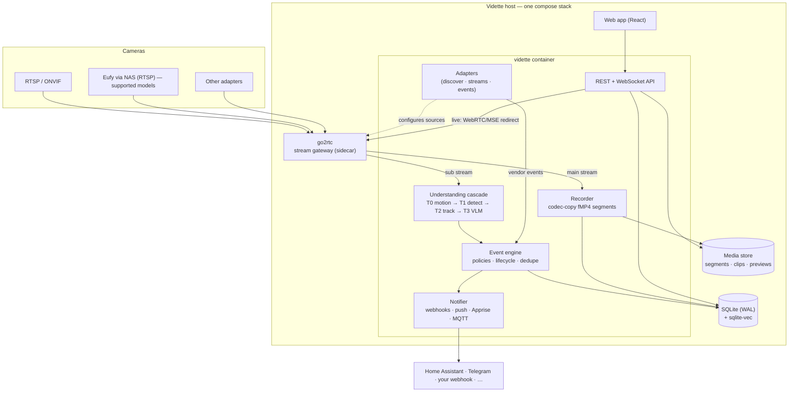

# Architecture overview

Vidette is a **modular monolith** shipped as one container plus a stream-gateway sidecar
(go2rtc). One box, one compose file, no cluster — deliberately boring infrastructure so the
interesting parts (the understanding cascade) get the complexity budget.
Rationale: [ADR-0001](adr/0001-runtime-and-languages.md).



## Components

| Component | Role | Runtime | Status |
|---|---|---|---|
| **go2rtc** (sidecar) | One connection per camera; fan-out to recorder, pipeline, and browsers (WebRTC/MSE/RTSP). We manage its config; we do not fork it. [ADR-0002](adr/0002-stream-gateway-go2rtc.md) | Go (upstream) | 📐 M1 (managed); runs today as sidecar |
| **Adapters** | Turn any camera ecosystem into: stream endpoints + event feed + capabilities. Vendor pain isolated here. [plugins.md](plugins.md) | Python (+ sidecars for non-Python bridges) | ✅ SDK interfaces · 📐 runtime |
| **Recorder** | Segmented codec-copy recording (no transcode), segment index, retention enforcement. *Sacred: nothing may stall it.* [storage.md](storage.md) | Python supervising FFmpeg | 📐 M1 (retention planner ✅) |
| **Understanding cascade** | Tiered analysis: cheap filters gate expensive reasoning. [ai-pipeline.md](ai-pipeline.md) | Python + ONNX Runtime + llama.cpp/Ollama | 📐 M2–M3 (protocols ✅) |
| **Event engine** | Observations → events; policy evaluation; dedupe; feedback. | Python | 📐 M2 (models ✅) |
| **Notifier** | Signed webhooks, web push (VAPID), Apprise (100+ services), MQTT + HA discovery. | Python | 📐 M2 (signing ✅) |
| **API** | REST + WebSocket, OpenAPI; session auth + scoped tokens. [api.md](../api.md) | FastAPI | ✅ skeleton |
| **Web app** | Live wall, timeline, event review, zone editor, settings. | React + TS + Vite | ✅ shell |
| **Store** | SQLite WAL (metadata, events, embeddings via sqlite-vec, FTS5); filesystem for media. Postgres optional later. [ADR-0008](adr/0008-database.md) | — | ✅ choice · 📐 schema M1 |

## Process model

One container, a small supervised process tree — not microservices:

- **api** — FastAPI/uvicorn, serves UI + API + WebSocket.
- **recorder** — one FFmpeg child per camera (copy mode), watchdog with exponential backoff,
  segment finalization and fsync policy.
- **pipeline workers** — decode substreams and run tiers; inference in a process pool sized to
  hardware; VLM via local sidecar (Ollama) or external API.
- **notifier** — delivery queue with retries/backoff, per-channel rate limits.

Crash isolation: a worker dying never takes the recorder down; the supervisor restarts children
with jitter and surfaces repeated failures as system events (visible in UI, forwardable as
notifications — the system snitches on itself).

## Data flow and backpressure

Priority order under load — the **shedding ladder** ([principles](../project/principles.md)):

1. Tier 3 (VLM) work is dropped first (queued events keep their Tier 2 verdicts).
2. Tier 1–2 detection fps degrades next.
3. Preview/scrub-strip generation pauses.
4. The recorder and the event log **never** shed.

Every queue is bounded; every drop is counted and visible in `/metrics` (M2) and the UI.

## Directory layout at runtime

```
/config/vidette.yaml        # your config (env-interpolated, validated on boot)
/config/vidette.db          # SQLite (WAL): segments, events, embeddings, users, tokens
/media/vidette/<camera>/YYYY/MM/DD/HH/*.mp4     # fMP4 segments (codec-copy)
/media/vidette/<camera>/events/<event-id>/      # clip.mp4 · snapshot.webp · context.json
/media/vidette/<camera>/previews/               # scrub strips for the timeline
```

## Network surface

| Port | What | Exposure guidance |
|---|---|---|
| 8642/tcp | Vidette UI + API | LAN or VPN only; TLS via your reverse proxy if exposed |
| 1984/tcp | go2rtc admin API | localhost/compose network only — never publish |
| 8554/tcp | go2rtc RTSP restreaming | optional, LAN only |
| 8555/tcp+udp | go2rtc WebRTC | LAN; WebRTC handles NAT via ICE when proxied |

Cameras should live on an isolated VLAN with no WAN egress; Vidette is their only client.
Full guidance: [security-model.md](security-model.md).

## What Vidette deliberately is not

- **Not a distributed system.** One node until M5's multi-node exploration; SQLite until a
  real deployment proves it insufficient ([ADR-0008](adr/0008-database.md)).
- **Not a home-automation hub.** HA/MQTT are first-class *integrations*, not something we
  reimplement.
- **Not a fork farm.** go2rtc, FFmpeg, ONNX Runtime, Apprise and community bridge projects
  are consumed as upstreams; we contribute fixes upstream instead of vendoring.
