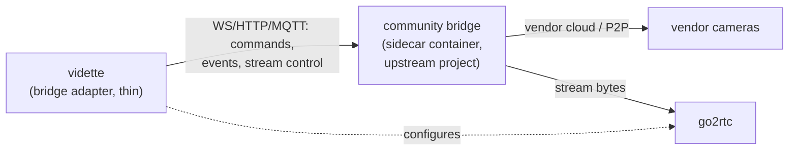

# Plugin architecture

> **Status:** adapter SDK interfaces ✅ (typed, in `server/vidette/adapters/base.py`);
> runtime loading 📐 M1–M2; third-party registry 📐 M5. Rationale: [ADR-0005](adr/0005-plugin-model.md).

Vidette's core is universal; everything vendor- or hardware-specific is a plugin. This is a
product decision as much as a technical one: **camera pain is an adapter, not a fork**, and
the docs treat each ecosystem as a pluggable page under [docs/cameras](../cameras/README.md).

## Plugin kinds

| Kind | Contract | Examples |
|---|---|---|
| **Camera adapter** | streams + events + capabilities for an ecosystem | `rtsp`, `onvif` (M1–M2); bridge adapters as viable upstreams exist |
| **Detector backend** | Tier 1 inference on a given accelerator | onnxruntime-cpu/openvino/tensorrt/coreml; hailo, coral (M3+) |
| **Understander** | Tier 3 provider | ollama, llama-cpp, openai, anthropic, google |
| **Notifier** | deliver a rendered event | webhook, webpush, apprise (which itself fans out to 100+ services) |
| **Storage backend** | off-site targets | s3-compatible (M3) |

## Camera adapter contract

An adapter answers four questions (see the typed `CameraAdapter` protocol):

1. **Who are you?** — `AdapterInfo`: id, display name, maturity (`stable | beta | designed`),
   docs URL, `Capability` flags (`LIVE_MAIN`, `LIVE_SUB`, `EVENTS_PUSH`, `PTZ`,
   `TWO_WAY_AUDIO`, `CLIP_DOWNLOAD`, `SNAPSHOT`).
2. **Can you reach this camera?** — `probe(config)` returns actionable diagnostics, not a
   boolean ("auth failed" ≠ "host unreachable" ≠ "RTSP disabled in vendor app — here's how to
   enable it").
3. **Where are the streams?** — `streams(config)` returns endpoints Vidette feeds to go2rtc.
   Adapters never decode video themselves.
4. **What is happening?** — `events(config)` yields vendor push events (motion, doorbell,
   battery) as normalized `Observation`s; used both for UX and as Tier 0 wake signals for
   sleepy battery cameras.

Packaging: Python entry points in the `vidette.adapters` group. Third-party adapters are
ordinary pip packages (`vidette-adapter-<vendor>`) — no forking, no registration ceremony.
The M5 registry is a docs page listing conformant packages, not a gatekeeper service.

## The sidecar-bridge pattern

The best reverse-engineered ecosystem clients are usually not Python (Ring's lives in
`ring-mqtt`, Wyze's in `docker-wyze-bridge`, …). We do not port them — we run them as
sidecar containers and keep the Python adapter thin:

Properties of the pattern:

- Upstream keeps ownership of the hard protocol work; we contribute fixes upstream and pin
  versions. Credit flows where it belongs.
- A sidecar crash degrades one ecosystem — never the recorder or other cameras.
- Vendor API breakage is contained in one container with one pinned tag; core is untouched.
  This is not hypothetical: the pattern's original motivating example — a Eufy bridge over
  the community's reverse-engineered client — [died with Anker's API migration](../cameras/eufy.md#why-there-is-no-bridge)
  before it shipped. The blast radius was one docs page and zero core code, which is
  exactly the property the pattern buys.
- Candidate first users when their upstreams warrant it: `ring-mqtt`,
  `docker-wyze-bridge`, UniFi Protect clients.

## Conformance & quality tiers

Adapters advertise maturity and are held to it:

- **core** — maintained in this repo, covered by CI and (M2+) hardware-in-the-loop smoke tests.
- **verified** — third-party, passes the conformance suite (probe diagnostics, capability
  honesty, reconnect behavior, clean teardown), reviewed once.
- **community** — listed with a caveat banner.

The conformance suite (📐 M5) is the same test battery core adapters run — capability flags
must match observed behavior, because the UI renders what adapters *claim*.

## Non-goals

- No dynamic code download or plugin marketplace with remote execution — plugins are installed
  by the operator, versioned by pip/OCI, subject to the same supply-chain rules as core.
- No stable *internal* API promises before M5; the plugin SDK gets semver discipline at 1.0.
