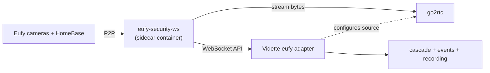

# Eufy

> **Status: 📐 designed — adapter preview targeted at M2, stable at M3.** This page exists
> now because Eufy owners are the project's founding audience; it will grow into the best
> "free your Eufy cameras" guide on the internet. Not affiliated with Anker/Eufy; trademarks
> belong to their owners.

Eufy hardware is generally well-regarded; the app experience and the closed ecosystem are why
this project exists. There are two paths to get Eufy video into Vidette, and an honest risk
note you must read before buying more Eufy gear.

## Path 1 — native RTSP (best, when your model supports it)

Some Eufy devices (typically mains-powered cameras and certain HomeBase-attached models) can
enable an RTSP stream in the Eufy app (device settings → storage/NAS or "RTSP" — location
varies by model and app version). If yours can:

1. Enable RTSP in the Eufy app; set credentials.
2. Add the camera to Vidette as a plain `rtsp` source — done. No bridge, no cloud dependency
   for streaming, tier-C support today (M1) like any other RTSP camera.

Caveats seen in the wild: RTSP silently capped at sub-resolution on some models; streams that
stop when the app "sleeps" the camera; battery models generally *not* offering RTSP at all.
The community keeps model lists current — check recent reports for your exact model, and
[record your findings](https://github.com/baadev/vidette/issues/new?template=camera_support.yml)
so the matrix here fills in with verified entries.

## Path 2 — the bridge (for everything else)

For battery cameras, doorbells and ecosystems without RTSP, Vidette's adapter (📐 M2) wraps
[**eufy-security-ws**](https://github.com/bropat/eufy-security-ws) — bropat's WebSocket server
around [`eufy-security-client`](https://github.com/bropat/eufy-security-client), the
community's reverse-engineered client for Eufy cloud auth + local/remote P2P:



What the adapter is designed to deliver through the bridge:

| Capability | Notes |
|---|---|
| Live view (P2P) | wake-on-demand for battery cams; expect 1–3 s wake latency |
| Vendor push events | motion/person/doorbell — used as Tier 0 wake signals, so sleepy cameras still get analysis |
| **HomeBase clip ingestion** | pull station-recorded clips into Vidette's storage — *your recordings finally live on your disk, searchable, exportable, backed up off-site (M3)* |
| Snapshots | for notifications when no stream is up |
| Two-way audio / PTZ | 🔭 per-model, later |

### Setup sketch (final walkthrough ships with the adapter)

1. Run the `eufy-security-ws` sidecar (compose profile will be provided).
2. **Use a dedicated Eufy account** shared to from your main account — Eufy enforces
   single-session semantics per account, so reusing your phone's account logs your app out.
   Enable 2FA and complete the captcha/OTP dance once via the bridge's flow.
3. Point the adapter at the bridge:

```yaml
cameras:
  backyard:
    adapter: eufy
    options:
      bridge_url: ws://eufy-ws:3000
      station_sn: T8010XXXXXXXXX   # optional pin to one station
```

### Battery reality check

P2P live streaming wakes the camera and costs battery; continuous 24/7 recording from battery
Eufy cams is not a thing any software can honestly give you. Vidette's design leans on vendor
push events + HomeBase clip pull + on-demand live — you get the *outcomes* (events, evidence,
review) without pretending the hardware is something it isn't.

## Upstream risk

**Read this before buying more closed-ecosystem hardware.** Anker has been migrating Eufy to
a new backend platform and retiring the legacy APIs that `eufy-security-client` reverse
engineered; the upstream project itself warns that when the legacy API fully shuts down, the
library stops working until/unless the community re-does the work. Consequences for you:

- The bridge path is **best-effort by nature**: pinned sidecar versions, adapter marked
  `beta` until the dust settles, breakage tracked in a pinned issue.
- Native-RTSP models are the *durable* part of the Eufy story: if RTSP is enabled locally,
  your streaming path has no vendor cloud dependency.
- This risk is exactly the project's thesis: **the recording/understanding layer should
  belong to you.** Vidette treats every vendor bridge as replaceable plumbing so that a
  vendor pivot can cost you the bridge, never the archive.

Gratitude where due: bropat and contributors have carried the Eufy community for years.
If the bridge is part of your setup, consider sponsoring their work.
