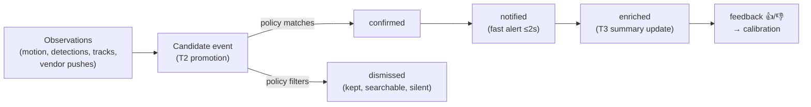

# Events & automations

> **Status: 📐 designed — lands in M2** (webhook HMAC signing is implemented and tested
> today). This page is the contract automation authors build against; breaking it after M2
> will require a deprecation cycle.

## The event lifecycle



Dismissed events are **not deleted** — they're the quiet majority you can still browse and
search ("show me everyone at the gate today"), and they're the raw material for calibration.

## Event payload (canonical shape)

Used by the API, WebSocket and webhooks alike:

```json
{
  "event": "event.confirmed",
  "id": "01hxv7q8e9",
  "camera": "front-door",
  "started_at": "2026-07-07T21:14:03.412Z",
  "ended_at": null,
  "kinds": ["person"],
  "zones": ["door"],
  "geometry": { "approach": 0.92, "dwell_s": 14.2, "touch": true, "repeat_pass": 0 },
  "summary": "A person approached the front door, tried the handle twice, and looked through the side window.",
  "intent": { "label": "entry_attempt", "score": 0.87, "model": "qwen2.5-vl-7b" },
  "policy": "entry-interest",
  "media": {
    "snapshot_url": "https://vidette.local/api/v1/events/01hxv7q8e9/snapshot.webp",
    "clip_url": "https://vidette.local/api/v1/events/01hxv7q8e9/clip.mp4",
    "live_url": "https://vidette.local/live/front-door"
  }
}
```

`summary` and `intent` are `null` until Tier 3 enrichment lands (or forever, if you run
without a VLM — geometry alerts stand on their own).

## Webhooks

```yaml
notifications:
  channels:
    hooks:
      kind: webhook
      url: https://automation.example.com/vidette
      secret: ${VIDETTE_WEBHOOK_SECRET}
      include: [summary, snapshot_url, clip_url]
  rules:
    - when: event.confirmed
      channels: [hooks]
    - when: system.*        # disk pressure, camera offline, recorder gaps
      channels: [hooks]
```

**Delivery contract:**

- `POST`, JSON body, 10 s timeout, 3 retries with exponential backoff + jitter.
- Headers: `X-Vidette-Event` (type), `X-Vidette-Delivery` (unique id),
  `X-Vidette-Timestamp` (unix seconds), `X-Vidette-Signature`.
- Ordering is best-effort; consumers key on `id` + `event` for idempotency.
- `enriched` updates re-POST the same `id` with `event: "event.enriched"`.

### Verifying signatures

`X-Vidette-Signature: sha256=<hex>` where `<hex> = HMAC_SHA256(secret, timestamp + "." + body)`.
Reject if the timestamp is more than 5 minutes old (replay protection).

```python
import hmac, hashlib

def verify(secret: str, timestamp: str, body: bytes, signature: str) -> bool:
    expected = "sha256=" + hmac.new(
        secret.encode(), f"{timestamp}.".encode() + body, hashlib.sha256
    ).hexdigest()
    return hmac.compare_digest(expected, signature)
```

```js
import { createHmac, timingSafeEqual } from "node:crypto";

const verify = (secret, timestamp, body, signature) => {
  const expected = "sha256=" + createHmac("sha256", secret)
    .update(`${timestamp}.`).update(body).digest("hex");
  return timingSafeEqual(Buffer.from(expected), Buffer.from(signature));
};
```

The reference implementation lives in `server/vidette/notify/signing.py` (tested).

## Push, Telegram and friends

- **Web push (VAPID)** — PWA notifications with the snapshot inline; no vendor cloud between
  your camera and your phone. (iOS requires the PWA installed to the home screen — documented
  honestly in the FAQ.)
- **Apprise channels** — one URL string per destination covers Telegram, Discord, Slack,
  Pushover, Matrix, ntfy, email and ~100 more:

```yaml
notifications:
  channels:
    telegram: { kind: apprise, url: "tgram://${TG_BOT_TOKEN}/${TG_CHAT_ID}" }
```

Message templates are Jinja-lite with the payload above in scope; defaults produce
`{{summary}}` + snapshot + a deep link to the event.

## MQTT & Home Assistant

With `integrations.mqtt` enabled, Vidette publishes under `vidette/` and announces entities
via HA MQTT discovery:

| Topic | Payload |
|---|---|
| `vidette/<camera>/event` | the canonical event JSON |
| `vidette/<camera>/person` | `on/off` occupancy |
| `vidette/<camera>/motion` | `on/off` |
| `vidette/<camera>/snapshot` | JPEG bytes of the last event |
| `vidette/system/health` | recorder/disk/adapter health |

Cookbook (M2 ships these as copy-paste HA blueprints):

- *Announce on speakers when a person dwells at the door > 10 s and nobody is home.*
- *Turn on porch light on `event.confirmed` at night; flash it on `intent.score > 0.8`.*
- *Forward `system.*` (disk pressure, camera offline) to the admin phone — the security
  system snitches on itself.*

## Export & sharing

- `POST /api/v1/export {camera, from, to}` → MP4 remux job (no re-encode, near-instant).
- Per-event share links: signed, expiring URLs for a clip+snapshot bundle — hand evidence to
  a neighbor or the police without creating accounts. (Redacted export — blur regions — is 🔭 M3+.)
